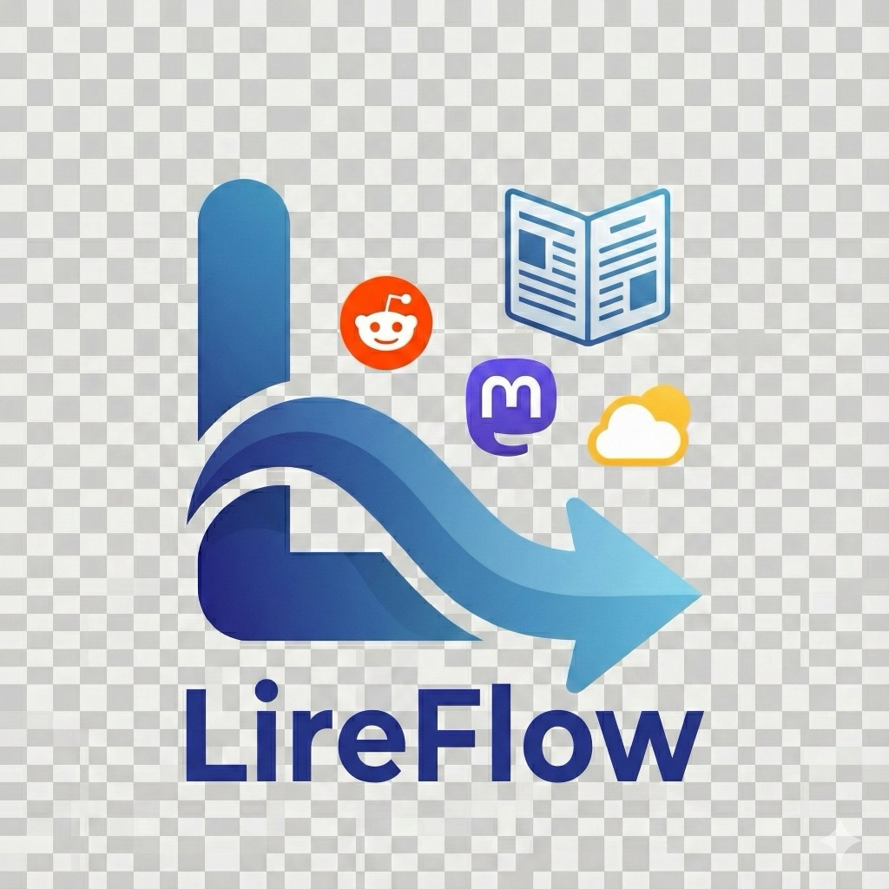

# LireFlow

<p align="center">
  
</p>

A modern, native macOS RSS reader built with SwiftUI and SwiftData.


> 🎨 Logo generated by **Nano Banana**  
> 🤖 Entire project vibecoded by **Claude Opus**

## Features

### 📰 Feed Management

- Add RSS/Atom feeds from any URL
- **Quick add from clipboard** - Auto-detects URLs when adding feeds
- **Feed search/filter** - Quickly find feeds in sidebar with real-time filtering
- Organize feeds into folders
- Drag and drop feeds between folders
- Automatic feed icon fetching via Google Favicons
- **Feed health monitoring** - Visual indicators for broken or stale feeds
- Last update time tracking with relative timestamps
- **200+ default feeds** across 25+ categories (Tech, News, AI, Security, Gaming, France, etc.)

### 📖 Article Reading

- Clean, distraction-free reading view
- **Reading time estimates** - Shows estimated read time for each article
- Full article extraction for truncated feeds
- Mark articles as read/unread and starred
- **Archive articles** - Archive articles to keep them organized separately
- Reading lists for saving articles
- **Copy as Markdown** - Export articles in Markdown format via context menu
- **Print articles** - Print articles with proper formatting and metadata

### 🎨 Modern UI

- Native macOS design with liquid glass effects
- Dark/Light mode toggle (in sidebar or Settings)
- Smooth animations and hover effects
- Three-column layout (Sidebar, List, Detail)
- Comprehensive Settings window (⌘,) for customization
- **Dock badge** showing unread article count
- **Dock menu** with quick actions (New Feed, Refresh, Mark All Read, Settings)
- **Full keyboard navigation** with vim-style shortcuts

### ☀️ Weather Widget

- Local weather display in sidebar (toggleable in Settings)
- 7-day forecast with tap for details
- Dynamic weather icons with color coding
- Auto-detect location or set custom location

### 💾 Backup & Import

- Export library to JSON (complete backup with feeds, folders, and reading lists)
- Export feeds to OPML (standard RSS format for portability)
- Import from JSON or OPML files
- Automatic duplicate detection during import
- Accessible via File menu or Settings window

### ⌨️ Keyboard Shortcuts

- **J/K** - Navigate to next/previous article
- **M** - Mark article as read/unread
- **S** - Toggle star on article
- **V** - Open article in browser
- **⌘R** - Refresh all feeds
- **⌘N** - Add new feed
- **⌘⇧A** - Mark all articles as read
- **⌘⇧N** - Add new folder
- **⌘,** - Open Settings
- **⌘⇧E** - Export to JSON
- **⌘⇧I** - Import from JSON

### ⚡ Performance & Optimization

- **Load images toggle** - Disable image loading to save bandwidth
- **Background refresh control** - Enable/disable background feed updates
- **Max articles per feed** - Configurable limit (100-1000 articles)
- **Smart cleanup** - Automatically remove old articles (configurable 7-90 days)
- **Manual cleanup** - One-click cleanup of old articles (preserves starred/archived)
- Optimized database queries and SwiftData performance

### 🔧 Additional Features

- Reddit, Mastodon, and Lemmy feed support
- Paywall bypass options (12ft.io, Archive.today)
- Europresse integration for press archives
- File-based configuration (`~/Library/Application Support/LireFlow/config.json`)

## Requirements

- macOS 14.0 (Sonoma) or later
- Xcode 15.0 or later

## Installation

### Option 1: Homebrew (Recommended)

```bash
brew tap m0etez/lireflow
brew install --cask lireflow
```

Or install in one command:

```bash
brew install --cask m0etez/lireflow/lireflow
```

### Option 2: Download DMG

Download the latest release from the [releases page](https://github.com/m0etez/LireFlow/releases/latest).

### Option 3: Build from Source

1. Clone the repository:

   ```bash
   git clone https://github.com/m0etez/LireFlow.git
   cd LireFlow
   ```

2. Open in Xcode:

   ```bash
   open LireFlow.xcodeproj
   ```

3. Build and run (⌘R)

## Project Structure

```
LireFlow/
├── LireFlowApp.swift           # App entry point
├── Models/
│   ├── Article.swift           # Article data model
│   ├── Feed.swift              # Feed data model
│   ├── Folder.swift            # Folder data model
│   ├── ReadingList.swift       # Reading list model
│   └── ExportableModels.swift  # Export/import DTOs
├── Services/
│   ├── FeedParser.swift        # RSS/Atom parsing
│   ├── FeedService.swift       # Feed management
│   ├── ArticleExtractor.swift  # Full article extraction
│   ├── WeatherService.swift    # Weather API integration
│   ├── ConfigService.swift     # File-based settings
│   ├── ExportService.swift     # JSON/OPML export
│   ├── ImportService.swift     # JSON/OPML import
│   └── DefaultFeeds.swift      # Starter feed suggestions
├── Views/
│   ├── ContentView.swift       # Main app layout
│   ├── Sidebar/
│   │   ├── SidebarView.swift
│   │   ├── WeatherWidget.swift
│   │   └── WeatherDetailPopover.swift
│   ├── Articles/
│   │   ├── ArticleListView.swift
│   │   └── ArticleDetailView.swift
│   └── Sheets/
│       ├── AddFeedSheet.swift
│       ├── AddFolderSheet.swift
│       ├── AddReadingListSheet.swift
│       └── SettingsSheet.swift
└── Utilities/
    └── Extensions.swift
```

## Configuration

Access Settings via **⌘,** or the **LireFlow > Settings** menu.

### Settings Tabs

**General:**
- Appearance (Dark/Light mode)
- Show/hide unread count badges
- Article font size (12-24pt)
- Mark as read on scroll
- Feed refresh interval
- Default feed category
- Weather widget visibility
- Custom weather location
- Performance settings:
  - Load images toggle
  - Background refresh control
  - Max articles per feed (100-1000)
  - Cleanup old articles (7-90 days)
  - Manual cleanup button

**Backup & Import:**
- Export to JSON (complete library backup)
- Export to OPML (feeds only)
- Import from JSON or OPML
- Automatic duplicate detection

**About:**
- App version and information
- GitHub repository link
- Twitter/social links
- "Built with Claude" attribution

All settings are automatically saved to:
```
~/Library/Application Support/LireFlow/config.json
```

## Technologies

- **SwiftUI** - Modern declarative UI
- **SwiftData** - Persistent data storage
- **WebKit** - Article rendering
- **CoreLocation** - Weather location
- **Open-Meteo API** - Weather data (free, no API key)

## License

MIT License - see [LICENSE](LICENSE) file for details.

## Contributing

Contributions are welcome! Please feel free to submit a Pull Request.

[](https://ko-fi.com/R5R5E8VSB)
